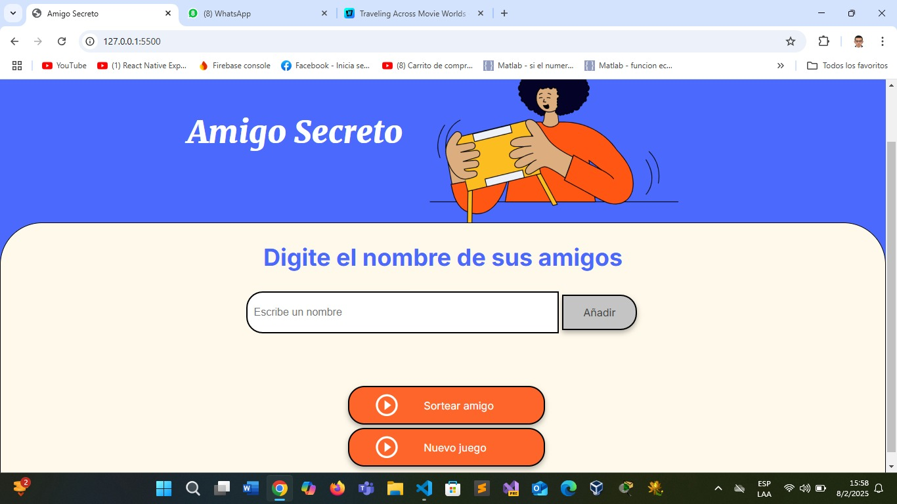
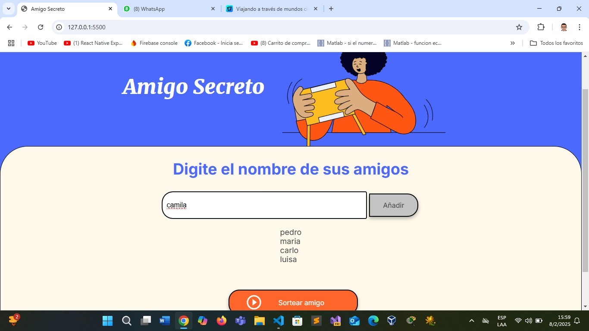
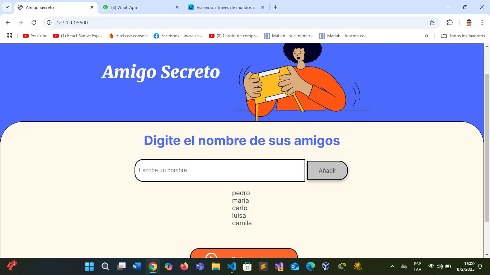
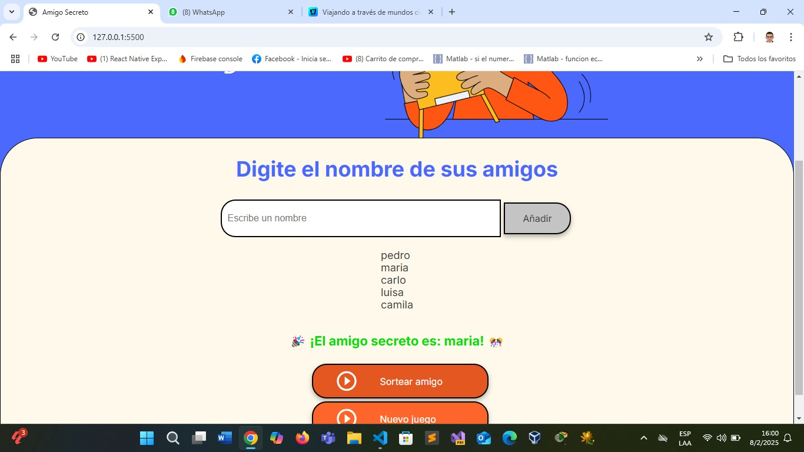

#  Amigo Secreto

Este es un pequeño proyecto en **JavaScript, HTML y CSS** que permite agregar amigos a una lista y realizar un **sorteo del amigo secreto** para elegir un amigo secreto. 

## Características

✅ Agregar nombres a una lista.  
✅ **Evita duplicados** (no se pueden agregar nombres repetidos).  
✅ **Validación de nombres** (solo permite letras y espacios, sin números ni caracteres especiales).  
✅ **Sortear un amigo secreto aleatorio** cuando hay al menos 2 participantes.  
✅ **Borrar la lista** y ocultar el resultado en cualquier momento.  
✅ **Interfaz simple y fácil de usar**.

## 🎬 Capturas de Pantalla

### 🎯 **Pantalla Principal**

### ✅ **Agregando Amigos**

### 🎉 **Sorteo Realizado**

## 🛠️ **Tecnologías Usadas**

- **HTML** → Estructura de la interfaz.  
- **CSS** → Estilos para mejorar la apariencia.  
- **JavaScript** → Lógica del sorteo y validaciones.
